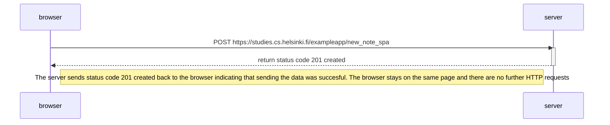

```mermaid

sequenceDiagram
    participant browser
    participant server
    
    browser->>server: POST https://studies.cs.helsinki.fi/exampleapp/new_note_spa
    activate server
    server-->>browser: return status code 201 created
    deactivate server

    Note right of browser: The server sends status code 201 created back to the browser indicating that sending the data was succesful. The browser stays on the same page and there are no further HTTP requests
```